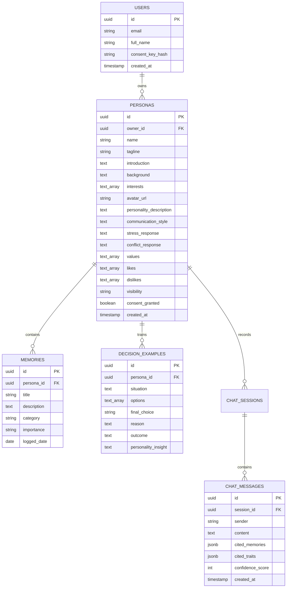

# Persona Echo

Recreate and improve the frontend of this project based on the README below.
Keep the same features, page structure, routes, and user flow.
Create a modern, polished, responsive UI suitable for an AI product.
Do not remove any required functionality.
Use realistic placeholder data only where backend integration is not yet connected.
Keep the code organized so it can later connect to Supabase and an AI backend.               # 🧠 PersonaTwin — Consent-Based AI Persona Platform

[](https://react.dev/)
[](https://www.typescriptlang.org/)
[](https://tailwindcss.com/)
[](https://vite.dev/)
[](LICENSE)

**PersonaTwin** is a consent-first AI digital twin platform that allows living individuals to create an interactive digital representation of themselves. By ingesting formative memories, core personal values, communication styles, stress/conflict thresholds, and historical decision-making examples, PersonaTwin enables authorized users to interact with an AI persona to predict what the individual would likely think, say, or choose in complex real-world situations.

> **Key Differentiator:** PersonaTwin is *not* a generic chatbot. It focuses specifically on **personality-based response generation, decision-pattern imitation, and explainable AI citations**.

---

## 📌 Table of Contents
- [Project Overview](#-project-overview)
- [Key Features](#-key-features)
- [Tech Stack](#-tech-stack)
- [Folder Structure](#-folder-structure)
- [Pages & Navigation Routes](#-pages--navigation-routes)
- [Component Architecture](#-component-architecture)
- [Database Requirements](#-database-requirements)
- [API & Backend Specifications](#-api--backend-specifications)
- [Current Implementation Status](#-current-implementation-status)
- [Getting Started](#-getting-started)

---

## 📖 Project Overview

Modern AI conversational agents often lack individual human nuance, personal ethics, memory context, and decision-making consistency. PersonaTwin solves this by offering a structured 5-step blueprint where owners upload:
1. **Formative Life Memories** (Outages, career milestones, personal dilemmas).
2. **Decision-Making Matrices** (Scenarios, options, trade-off rationale, and outcomes).
3. **Communication & Behavioral Profiles** (Stress thresholds, conflict strategies, analogies).
4. **Values & Boundaries** (Likes, dislikes, career trade-offs, non-negotiables).

Interacting users can ask situational questions or run complex decision simulations. Every response generated includes **Explainable AI Citations**, listing the exact memories, traits, and decision rules that informed the output.

---

## ✨ Key Features

- 🌐 **Interactive Landing Page**: Hero section featuring a live interactive twin preview widget and 4 feature cards (*Personality Memory, Decision Simulation, Voice Interaction, Explainable Responses*).
- 🔒 **Zero-Knowledge Consent Vault**: Cryptographically signed owner consent verification and privacy access controls (*Private, Unlisted, Authorized Users, Public*).
- 📊 **Persona Dashboard**: Central hub displaying profile completion percentage, memory count badges, decision example metrics, and quick shortcuts.
- 🧙‍♂️ **5-Step Persona Builder Wizard**: Step-by-step form with step indicators, dynamic array builders for memories/decisions, and instant sample data autofill (*Arun Sharma persona*).
- 👤 **Persona Profile & JSON Exporter**: Full view of personality summaries, core values, stress responses, and 1-click JSON schema export.
- 💬 **Explainable AI Chat**: Interactive chat interface with typing indicators, suggested situational questions, mandatory AI identity disclaimers, voice mode toggle, and expandable footnote citations.
- 🌿 **Decision Simulator Engine**: Input custom scenarios & choice options to receive choice forecasts, risk-weighting rationale, confidence percentages, and uncertainty notices.
- 🗃️ **Memory Management Repository**: CRUD operations for memories with category filtering (*Work, Personal, Career, Technical, Values, Relationships*) and keyword search.
- ⚙️ **Settings & Security**: Fine-grained visibility toggle, consent key audit log, and danger zone for permanent digital twin revocation.

---

## 🛠️ Tech Stack

- **Frontend Framework**: React 19 + TypeScript
- **Build Tool**: Vite 8.3
- **Styling & Design System**: 
  - Tailwind CSS v4 (with `@import "tailwindcss"`)
  - Glassmorphism & Cyberpunk dark navy theme (`#070913` background, slate-950, blue `#3B82F6` & violet `#8B5CF6` glows)
- **Icons**: Lucide React (`lucide-react`)
- **Animations & Effects**: Framer Motion (`framer-motion`), Canvas Confetti (`canvas-confetti`)
- **Utilities**: `clsx`, `tailwind-merge`

---

## 📁 Folder Structure

```
d:\ai persona\
├── index.html
├── package.json
├── tsconfig.json
├── vite.config.ts
└── src/
    ├── App.tsx                    # Main App container & page state manager
    ├── main.tsx                   # Vite entrypoint
    ├── index.css                  # Global styles, Tailwind imports, glassmorphism utilities
    ├── types/
    │   └── persona.ts             # TypeScript schemas (Persona, Memory, DecisionExample, ChatMessage, etc.)
    ├── data/
    │   └── mockData.ts            # Realistic demo data for Arun Sharma persona
    └── components/
        ├── Navbar.tsx             # Sticky responsive top navigation header & mobile drawer
        ├── Footer.tsx             # Platform footer with ethics links & page shortcuts
        ├── LandingPage.tsx        # Hero page with live twin preview & feature cards
        ├── AuthPages.tsx          # Login, Signup & Forgot Password authentication views
        ├── Dashboard.tsx          # User dashboard with completion bars & persona cards
        ├── CreatePersona.tsx      # Multi-step 5-stage form wizard with confetti finish
        ├── PersonaProfile.tsx     # Full profile view with tabbed sections & JSON export
        ├── AiChat.tsx             # Chat interface with explainability citations & voice mode
        ├── DecisionSimulator.tsx  # Choice simulator with confidence rating & evidence cards
        ├── MemoryManagement.tsx   # Memory repository CRUD with category search & filters
        └── Settings.tsx           # Privacy settings, visibility toggle & consent vault
```

---

## 🗺️ Page Names and Routes

| Page Name | Internal State Identifier | Primary Purpose |
| :--- | :--- | :--- |
| **Landing Page** | `'landing'` | Public introduction, hero live twin preview, feature cards & CTAs |
| **Authentication** | `'auth'` | Login, Signup & Forgot Password views with demo autofill |
| **Dashboard** | `'dashboard'` | Overview of active digital twins, completion %, and shortcuts |
| **Create Persona** | `'create-persona'` | 5-Step wizard to train persona identity, memories, and decision patterns |
| **Persona Profile** | `'persona-profile'` | Comprehensive persona details, tabbed sections, and JSON export |
| **AI Chat** | `'ai-chat'` | Interactive chat with explainable citations and voice visualizer |
| **Decision Simulator** | `'decision-simulator'` | Input custom dilemmas to receive choice predictions & evidence cards |
| **Memory Management** | `'memory-management'` | Ingested memory repository with search and category filter pills |
| **Settings** | `'settings'` | Privacy controls, persona visibility mode, and consent key vault |

---

## 🧩 Components Overview

- ``: Sticky header providing one-click navigation to all 9 pages, mobile navigation drawer, and quick auth actions.
- `

`: Brand details, ethics compliance statement, and navigation links.
- ``: Hero banner, live twin simulator card, 4 feature cards, and 5-step process blueprint.
- ``: Toggleable authentication interface supporting Login, Signup, and Forgot Key forms.
- ``: Statistics overview (*Completion %, Memory count, Decision count, Visibility status*) and active persona cards.
- ``: 5-step form wizard featuring progress indicators, validation, dynamic memory/decision array builders, and confetti.
- ``: High-impact hero header, quick stats, tabbed sections (*Overview, Memories, Decisions, Values*), and downloadable JSON export.
- ``: Real-time chat interface with persona avatar header, suggested questions, AI identity disclaimer, typing indicator, and expandable Explainable Twin Citation dropdowns.
- ``: Dual-column simulator card allowing custom situation/option inputs, producing forecasted choices, confidence ratings, and supporting memory citations.
- ``: Memory grid display with search input, category filters, and an Add/Edit modal dialog.
- ``: Radio matrix for persona visibility (*Private, Unlisted, Authorized, Public*), toggle for owner consent, and destructive delete zone.

---

## 🗄️ Database Requirements (For Future Backend Connection)

To transition from client-side mock data to a persistent database, the following relational / document schema is recommended:



---

## ⚡ API & Backend Requirements

### 1. Persona Management API
- `POST /api/v1/personas` — Create a new persona profile.
- `GET /api/v1/personas/:id` — Retrieve full persona profile details.
- `PUT /api/v1/personas/:id` — Update profile traits, values, or visibility parameters.
- `DELETE /api/v1/personas/:id` — Revoke consent and permanently wipe persona data.

### 2. Memory & Decision Vector Store API
- `POST /api/v1/personas/:id/memories` — Ingest a new memory log into vector storage.
- `GET /api/v1/personas/:id/memories` — List and filter memories by category/search query.
- `DELETE /api/v1/personas/:id/memories/:memoryId` — Delete a specific memory.
- `POST /api/v1/personas/:id/decisions` — Ingest a past decision-making example.

### 3. AI Inference & Simulation API
- `POST /api/v1/personas/:id/chat` — Send a message to the AI persona. Returns generated text along with cited memory IDs, matched traits, and confidence rating.
- `POST /api/v1/personas/:id/simulate` — Execute decision matrix simulation for a custom situation and choice list.

---

## 📊 Current Implementation Status

| Feature / Page | Status | Description |
| :--- | :---: | :--- |
| **Landing Page** | ✅ Complete | Full landing layout with live preview hero widget & feature cards |
| **Authentication** | ✅ Complete | Interactive Login/Signup/Forgot views with demo autofill |
| **Dashboard** | ✅ Complete | Active persona cards, profile completion progress, and stats |
| **Create Persona** | ✅ Complete | 5-step form wizard with step indicators & confetti celebration |
| **Persona Profile** | ✅ Complete | Full profile details, tabs, and JSON export capability |
| **AI Chat** | ✅ Complete | Dynamic persona chat with explainable citations & voice toggle |
| **Decision Simulator** | ✅ Complete | Scenario simulation with confidence ratings & evidence breakdown |
| **Memory Management** | ✅ Complete | Full CRUD operations, category filters, and search bar |
| **Settings** | ✅ Complete | Visibility controls, consent key status, and delete confirmation |
| **TypeScript / Build** | ✅ Complete | Clean compilation (`0 errors` on `npm run build`) |
| **Backend Integration** | ⏳ Planned | Client-side reactive state configured for seamless API integration |

---

## 🚀 Getting Started

### Prerequisites
- **Node.js**: v18.0.0 or higher
- **NPM**: v9.0.0 or higher

### Installation & Local Setup

1. **Clone the repository**:
   ```bash
   git clone https://github.com/your-username/personatwin.git
   cd personatwin
   ```

2. **Install dependencies**:
   ```bash
   npm install
   ```

3. **Start the local development server**:
   ```bash
   npm run dev
   ```
   Open your browser and navigate to `http://localhost:5173/`.

4. **Build for production**:
   ```bash
   npm run build
   ```

---

*Built with ❤️ for consent-first AI twin alignment.*

This project was built with [Lovable](https://lovable.dev).

## Build with Lovable

Continue developing this project in the [Lovable editor](https://lovable.dev/projects/92c33d8b-71d2-4b46-8e30-3bf75f4a1de9).

- **Ship faster**: describe what you want to build and Lovable handles the code.
- **Stay in sync**: every change made in Lovable is committed straight to this repository.
- **Full ownership**: this code is yours. Push to `main` on GitHub and your changes sync back into Lovable, ready for your next prompt.

## Development

Prefer working locally? You need Node.js and npm — [install with nvm](https://github.com/nvm-sh/nvm#installing-and-updating).

```sh
git clone <this-repository-url>
cd <repository-name>
npm i
npm run dev
```
